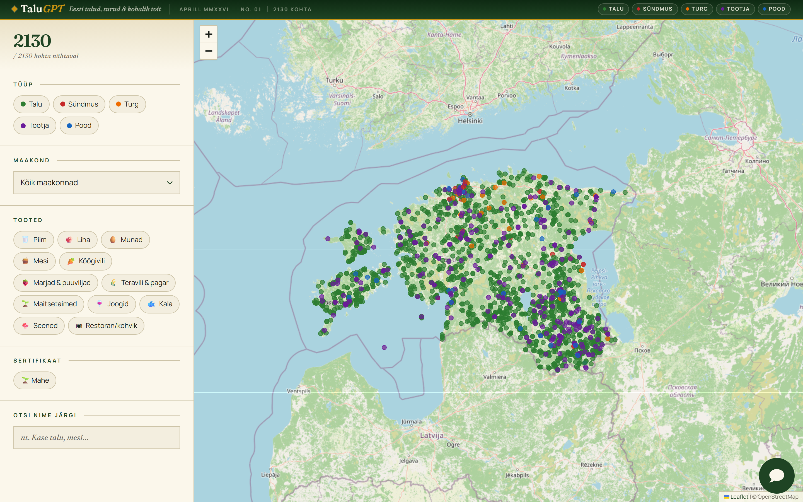
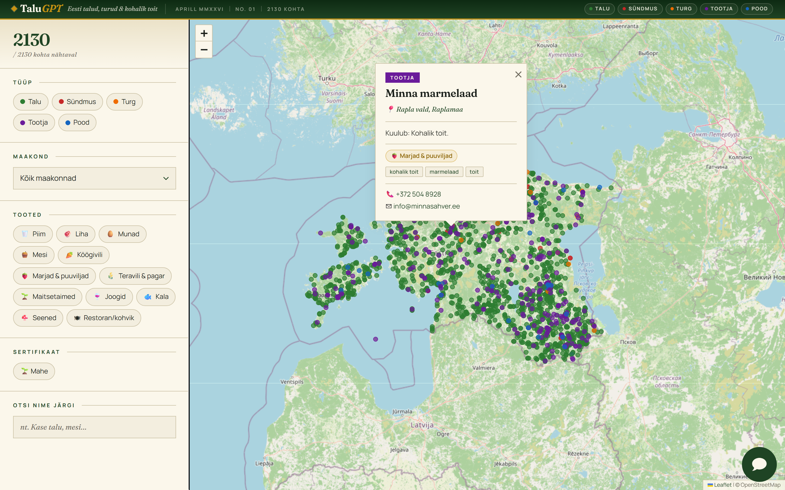

# TaluGPT 🇪🇪

**Natural-language local-food discovery for Estonia.**

Ask in Estonian or English — *"Kus saab Viimsis toorpiima?"* or *"Where can I buy organic honey near Tartu?"* — and get a Claude-powered answer alongside a Leaflet map highlighting the relevant farms, markets, producers, shops, and food events.



---

## What's in here

This repo contains the **web map** (Next.js 14 frontend) and the **unified Estonian farm dataset** that powers it. The dataset is consumed at build-time, sliced into a lighter payload, and served as `public/farms.json`. The conversational AI lives in an embedded chat widget that talks to an n8n workflow → Qdrant → Claude Opus 4.7.

```
talugpt/
├── frontend/                       Next.js 14 web map
│   ├── app/                          page, layout, globals.css
│   ├── components/
│   │   ├── FarmMap.tsx               Leaflet map + popup builder
│   │   ├── FilterPanel.tsx           Sidebar filters
│   │   └── ChatWidget.tsx            n8n chat embed
│   ├── lib/
│   │   ├── types.ts                  Farm, FarmDataset, FilterState
│   │   ├── products.ts               Food category taxonomy
│   │   └── farmFilter.ts             Filter logic
│   ├── scripts/
│   │   └── copy-data.mjs             Build-time slim of Full farm data.json
│   └── public/farms.json             Generated, served to the browser
│
├── data_pipeline/
│   └── Full farm data.json           2,130 records · the unified dataset
│
└── docs/
    └── screenshot.png
```

---

## The dataset — `Full farm data.json`

**2,130 deduplicated, geocoded venues** unified from:

| Source | Type | License |
|---|---|---|
| **PTA Mahepõllumajanduse Register** | Estonian organic farming registry | CC-BY |
| **e-Äriregister** | Estonian Business Registry | CC-BY 4.0 |
| **avatudtalud.ee** | Open Farms Day catalogue | Public |
| **kohaliktoit.maaturism.ee** | "Local Food" network | Public |
| **EPKK** | Estonian Chamber of Agriculture and Commerce | Public |
| **laadakalender.ee** | Estonian fair / market calendar | Public |

**Per-record schema** (selected fields):

| Field | Notes |
|---|---|
| `id`, `slug` | Stable identifier + URL-safe slug |
| `kind` | `farm` · `producer` · `shop` · `market` · `event` |
| `name` / `display_name` | Original + cleaned for UI |
| `lat` · `lng` · `coord_precision` | WGS84, with provenance of the coordinate |
| `county` · `municipality` | Maakond + vald/linn |
| `food_categories` · `primary_food_category` | Refined taxonomy (`dairy`, `fruit_berries`, `grain_bakery`, …) |
| `tags` | 225 unique Estonian keywords (`marja`, `kaer`, `lüpsilehm`, `mahe`, …) |
| `certifications` | e.g. `mahe` (organic) |
| `consumer_relevance` | `direct_sale` (high confidence) / `likely_direct` |
| `contact` | email · phone · website |
| `data_quality_score` | 0-100, used for ranking |
| `sources` | Provenance — list of `{source_id, ref, verification_note}` |

**Counts at a glance:**

```
By kind      : 1683 farms · 327 producers · 53 events · 35 markets · 32 shops
By county    : Võrumaa 268 · Pärnumaa 235 · Tartumaa 233 · Harjumaa 226 · …
By food cat. : meat 458 · fruit/berries 380 · dairy 264 · grain/bakery 187 · vegetables 241 · honey 73 · eggs 3 · …
```

---

## The chat — Qdrant + n8n + Claude Opus 4.7

The floating green chat button (bottom-right of the map) is an **embedded `@n8n/chat` widget** wired to an n8n workflow:

```
User question
   │
   ▼
@n8n/chat widget  ──POST──►  n8n webhook
                                │
                                ├─► embed query (Google `models/gemini-embedding-2`)
                                ├─► Qdrant semantic search (top-k by vector)
                                ├─► payload filter on county/municipality
                                ├─► distance re-rank (if user lat/lng known)
                                └─► Claude Opus 4.7 (claude-opus-4-7)
                                     ├─ system block — cached
                                     ├─ retrieved farm chunks — cached
                                     └─ user query (streamed back)
                                │
                                ▼
                         streaming Estonian/English answer
                         + structured farm-IDs to highlight on the map
```

### Why each piece

- **Qdrant** — vector DB on `:6333`, collection `codex_drive_rag`. One point per record; payload carries county, products, certifications, contact info for filterable retrieval.
- **Google `models/gemini-embedding-2`** — embeddings called from the n8n workflow (Google Gemini Embeddings node). Multilingual, handles Estonian + English in one space. Requires a Google AI / Vertex AI credential in n8n.
- **n8n** — orchestrates the retrieval loop and exposes the chat trigger as a webhook. Lets us iterate on retrieval/prompt without redeploying the frontend.
- **Claude Opus 4.7** (`claude-opus-4-7`) — the answering model. Prompt caching on the system block + the retrieved-context block keeps warm-path latency tight.

### Webhook URL (in `ChatWidget.tsx`)

```ts
const WEBHOOK_URL = "https://n8n.arleserver.cfd/webhook/codex-qdrant-chat";
```

> ⚠ The Chat Trigger node in n8n must list your site origin under **Allowed Origins (CORS)** — otherwise the browser blocks the request.

### The n8n workflow

The full backend workflow — Google Drive folder trigger → embed (Gemini) → Qdrant insert → chat trigger → Qdrant retrieval tool → **Anthropic Claude** → Redis chat memory — is exported as **[`talugpt rag.json`](talugpt%20rag.json)** (18 nodes). Import it into your own n8n instance via *Workflows → Import from file*, then re-attach your own credentials (Google Drive, Gemini, Qdrant, Anthropic, Redis) — only credential *IDs* are exported, never the secrets.

---

## Tech stack

| Layer | Tech |
|---|---|
| LLM | **Claude Opus 4.7** (`claude-opus-4-7`) — 1M context, prompt caching, streaming |
| Vector DB | **Qdrant** (Docker on `:6333`) — collection `codex_drive_rag` |
| Embeddings | **Google `models/gemini-embedding-2`** — called from the n8n workflow |
| Orchestration | **n8n** (self-hosted) — chat trigger → Qdrant tool → Claude |
| Frontend | **Next.js 14** (App Router) · React 18 · Leaflet · `@n8n/chat` |
| Map tiles | OpenStreetMap |
| Geocoding | Nominatim (free, no key) |
| Type | Fraunces (display) + Manrope (body), via `next/font/google` |

---

## Quick start (frontend only)

```bash
cd frontend
npm install
npm run dev          # http://localhost:3000
```

`npm run dev` runs `scripts/copy-data.mjs` first, which reads `data_pipeline/Full farm data.json`, slims it to the fields the map needs, and writes `public/farms.json`. The map fetches that on load and renders ~2,130 markers.

```bash
npm run build        # production build
npm run type-check   # tsc --noEmit
```

To wire up the chat widget end-to-end you also need:

1. **Qdrant** running with the farm vectors upserted into the `codex_drive_rag` collection. Payload contains `farm_id`, `name`, `county`, `municipality`, `lat`, `lng`, `products`, `certifications`, `contact`, `tags`, `food_categories`, `kind`. The vector dimension matches whatever you configured `models/gemini-embedding-2` to output.
2. **An n8n instance** with a Chat Trigger node, a Qdrant retrieval tool, and a Claude (Anthropic) node configured with `claude-opus-4-7` and prompt caching. The webhook URL goes into `ChatWidget.tsx`.
3. **`ANTHROPIC_API_KEY`** in n8n's credentials.

---

## Deploy

The frontend is configured for **Next.js static export** (`output: 'export'` in `next.config.js`), so it deploys to any static host.

### Option A — Netlify drag-and-drop

```bash
cd frontend
npm install
npm run build      # produces frontend/out/
```

Then drag `frontend/out/` onto **https://app.netlify.com/drop**.

### Option B — Netlify connected to this repo (auto-deploys)

`netlify.toml` at the repo root pre-configures everything:

```toml
[build]
  base    = "frontend"
  command = "npm install && npm run build"
  publish = "frontend/out"

[build.environment]
  NODE_VERSION = "20"
```

In Netlify: **Add new site → Import from Git → pick this repo** → settings auto-load from `netlify.toml`.

> The chat widget posts directly to the n8n webhook at `https://n8n.arleserver.cfd/webhook/codex-qdrant-chat`. The Chat Trigger node in n8n must list your Netlify domain (e.g. `https://talugpt.netlify.app`) under **Allowed Origins (CORS)**, otherwise the browser blocks chat requests.


## Design

**"Estonian editorial almanac"** — warm oat-paper background, deep forest green primary, mustard honey accent, refined Fraunces serif paired with Manrope. Newsroom-style header with dateline. Filter chips reveal active state with a pressed-pill drop shadow. Popups are styled like portrait cards: tracked kind-tag, large serif name, italic moss-green location line, MAHE certification badge, food-category badges, Estonian keyword tag pills, hyperlinks underline on hover.



---

## Data licensing & credits

- Source data is open per the licenses listed above (predominantly **CC-BY**).
- Coordinates were geocoded with Nominatim / OpenStreetMap (ODbL).
- Map tiles © OpenStreetMap contributors.

If you republish or build on this dataset, please credit the original sources via the `sources` field carried on every record in `Full farm data.json`.

---

## License

The application code is MIT-licensed. The dataset is redistributed under the licenses of its upstream sources — see the `sources` field on each record for provenance.
